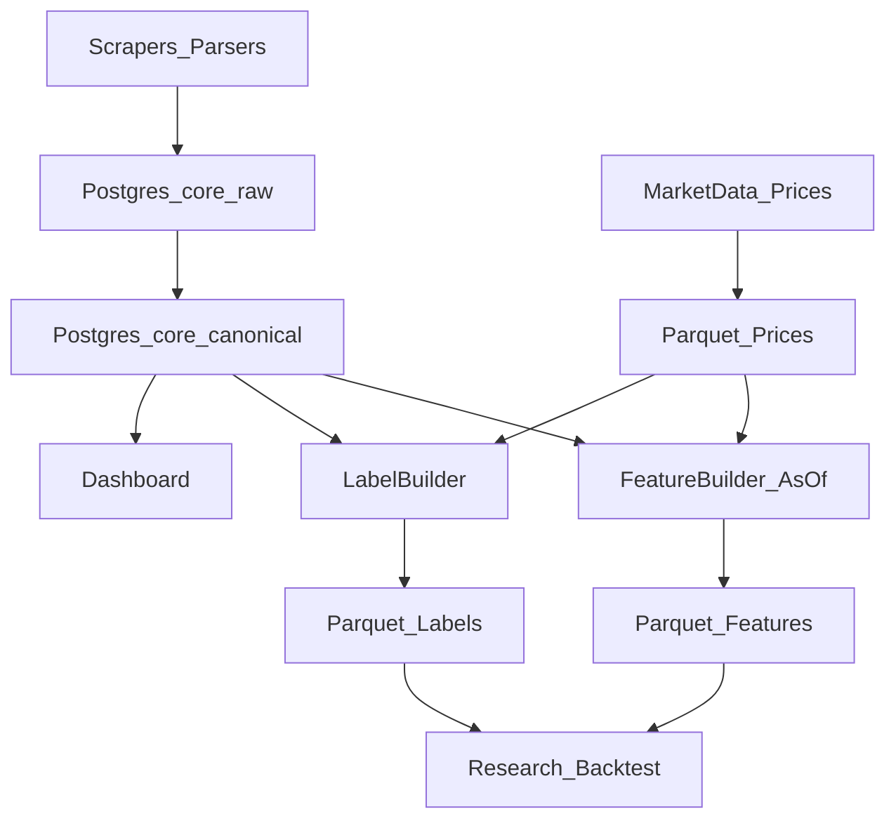

# Investimi — Data Architecture (Local-first)

This document defines the **data architecture** for building a private dataset for research/backtesting and future algotrading.

We use a **hybrid standard quant setup**:
- **Postgres**: source of truth for entities, events, filings, dedup, audit, and operations metadata.
- **Parquet (local lake)**: high-volume tables (prices/features/labels) for fast research and scalable storage.

The goal is to expand data sources over time without changing the core model.

---

## Key principles

### 1) No-lookahead timestamps
Every record that can affect decisions must carry:
- **event_time**: when it happened (e.g., transaction_date)
- **disclosed_at / released_at**: when it becomes knowable to you
- **ingested_at**: when your pipeline stored it

Backtests must only use records with `disclosed_at <= decision_time`.

### 2) Raw layer vs canonical layer
New sources get stored first as **raw** (immutable), then mapped to **canonical** tables.
This prevents schema churn and preserves traceability.

### 3) Strong dedup
Canonical events use a deterministic **fingerprint** (unique key) to avoid duplicates across re-runs or parsing changes.

---

## Postgres schemas and tables (MVP)

### `core.sources`
Catalog of sources/pipelines (e.g., `house_ptr_pdf`, `senate_efd_ptr`, `sec_edgar_form4`).

### `core.actors`
People/entities responsible for events.
- politicians (house/senate)
- insiders (SEC Form 4)

### `core.instruments`
Normalized instruments (ticker + optional CIK/ISIN/FIGI later).

### `core.filings`
Official containers:
- Senate PTR UUID
- House PTR PDF doc id / URL
- SEC accession number

### `core.trade_events`
Canonical trades (one row per transaction line).
Must include: side, amount range, shares/price when available, and timestamps (`transaction_date`, `disclosed_at`, `ingested_at`).

### `ops.ingestion_runs`
Operational metadata for each job run:
- when it ran, duration, counts, errors
- versions (commit hash) for reproducibility

Optional next:
- `core.raw_documents`: store raw HTML/PDF/XML/JSON bytes (or pointers + hashes)
- `core.raw_records`: store parsed-but-not-canonical rows as JSONB

---

## Local Parquet lake layout (MVP)

Root folder: `lake/`

### Prices
- `lake/prices/daily/symbol=<TICKER>/year=<YYYY>/month=<MM>/part-*.parquet`

### Features
- `lake/features/feature_set=v1/asof_date=<YYYY-MM-DD>/part-*.parquet`

### Labels
- `lake/labels/label_set=v1/anchor_date=<YYYY-MM-DD>/part-*.parquet`

### Snapshots (optional but recommended)
Immutable daily snapshots of “served” datasets:
- `lake/snapshots/date=<YYYY-MM-DD>/...`

The same layout can later be moved to S3/MinIO with no changes to the partitioning scheme.

---

## Module connections (data flow)



---

## Local setup (Postgres)

Use the included `docker-compose.yml` to run Postgres locally.

```bash
docker compose up -d
```

Connection defaults (can be changed in compose/env):
- host: `localhost`
- port: `5432`
- db: `investimi`
- user: `investimi`
- password: `investimi`

---

## What we have today vs what this enables

Today we already ingest:
- House PTR (PDF parsing)
- Senate PTR (Playwright-assisted EFD parsing)
- SEC Form 4 (EDGAR parsing)

This architecture allows adding many more sources later (earnings, macro vintages, options IV, flows, news), while keeping:
- consistent canonical tables
- reproducible backtests
- traceability to raw documents

